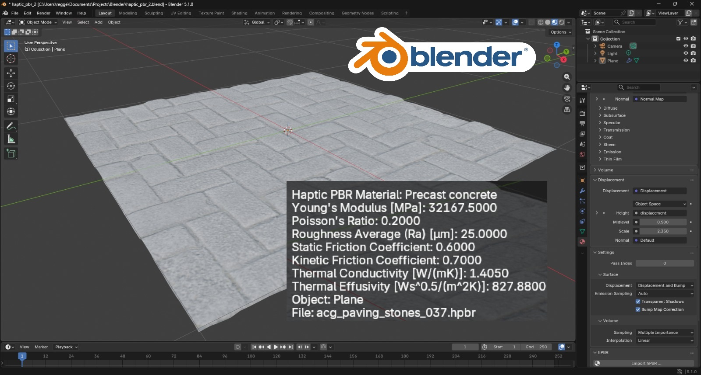
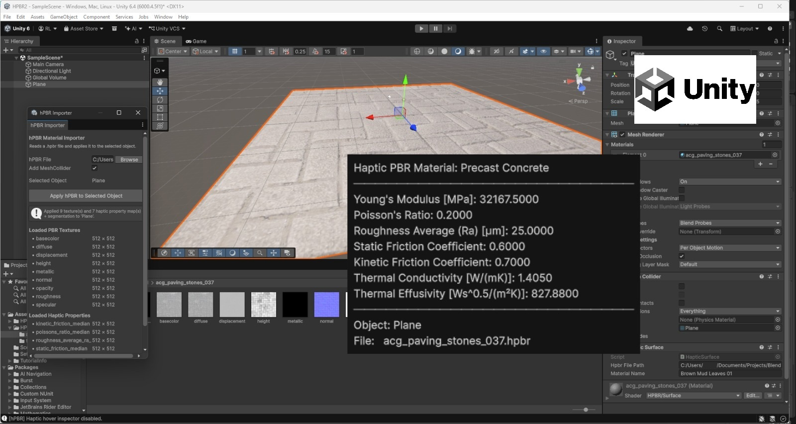
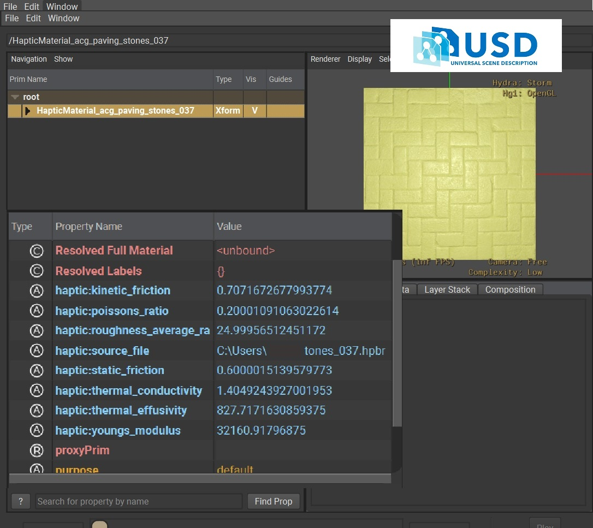
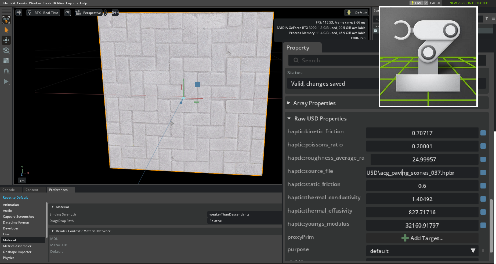

# hPBR Toolchain

Cross-platform tools for working with **haptic Physically Based Rendering (hPBR)** material files.
An hPBR file (`.hpbr`) bundles PBR textures (base color, normal, roughness, metallic, displacement, …)
together with per-pixel haptic property maps (Young's modulus, friction coefficients, thermal
properties, …) and an optional HapticNet material-class segmentation map — all in a single
self-contained binary.

This repository provides four integration layers:

| Tool | Language | Purpose |
|------|----------|---------|
| **Blender add-ons** | Python | Import `.hpbr` files as Principled BSDF materials; hover tooltip shows per-pixel haptic values |
| **Unity package** | C# / HLSL | Import `.hpbr` files onto GameObjects; runtime haptic property sampling; URP parallax shader |
| **hPBR → USD converter** | Python | Convert `.hpbr` files to USD stages with full material network and haptic metadata |
| **OpenUSD / Isaac Sim** | — | Open the converted `.usda` files directly in usdview, Omniverse, or Isaac Sim |

---

## Repository Structure

```
hPBR Tools/
├── Blender/
│   ├── hpbr_importer.py      # Blender add-on: imports .hpbr as Principled BSDF material
│   └── hover_tooltip.py      # Blender add-on: per-pixel haptic hover tooltip in 3D View
├── Unity/
│   └── HPBR/
│       ├── Runtime/
│       │   ├── HpbrReader.cs           # Binary .hpbr parser
│       │   ├── HapticSurface.cs        # MonoBehaviour: holds haptic data on a GameObject
│       │   ├── NpyReader.cs            # Minimal .npy file reader (no Python dependency)
│       │   ├── HapticNetSegReader.cs   # Pickle-stream segmentation map decoder
│       │   └── HpbrSurface.shader      # URP shader with parallax offset mapping
│       └── Editor/
│           ├── HpbrImporterWindow.cs   # Editor window: Window > HPBR > Import hPBR Material
│           └── HapticHoverInspector.cs # Scene overlay: per-pixel haptic hover tooltip
├── OpenUSD/
│   ├── hpbr_to_usd.py        # CLI converter: .hpbr -> USD stage
│   └── hpbr_to_usd.bat       # Windows launcher (sets up NVIDIA OpenUSD environment)
└── Images/
    ├── blender.jpeg
    ├── unity.jpeg
    ├── openusd.jpeg
    └── isaacsim.png
```

---

## hPBR File Format

An `.hpbr` file is a chunked binary container (magic `hPBR`, version `2`).
Each chunk carries a 4-byte tag, a length, a UTF-8 name, a payload, and a CRC-32 checksum.

| Tag | Payload | Description |
|-----|---------|-------------|
| `NARR` | 9-byte header + NumPy `.npy` bytes | Haptic property map (float32/64) or segmentation map (object array) |
| `IMAG` | format byte (1 = PNG) + raw PNG bytes | PBR texture tile |
| `IEND` | — | End-of-file sentinel |

**NARR header:** `rows (uint32 LE) | cols (uint32 LE) | pickle_flag (int8)`
- `pickle_flag = 0`: numeric array written with `numpy.save`
- `pickle_flag = 1`: object array of strings (segmentation class names)
- Chunks whose name ends with `_HapticNetSegmentation` carry the pixel-level material class map.

---

## 1 — Blender Add-ons



### Requirements

- Blender 4.0 or later
- NumPy (included with Blender's bundled Python)

### Installation

1. Open Blender.
2. Go to **Edit → Preferences → Add-ons → Install…**
3. Install `hpbr_importer.py` first, then `hover_tooltip.py`.
4. Enable both add-ons by ticking their checkboxes.

### hPBR Importer (`hpbr_importer.py`)

Imports an `.hpbr` file onto the active mesh object, building a full Principled BSDF node
graph with all available texture tiles automatically wired.

**Usage:**
- Select a mesh object in the 3D Viewport.
- Open the file browser via **Properties → Material → hPBR → Import hPBR…**
  (or the equivalent button in **Shader Editor → N-panel → hPBR**).
- Choose an `.hpbr` file. The material is built and applied immediately.
- Haptic property maps are cached in memory and accessible to `hover_tooltip.py`.

**Operator options** (shown in the file browser):

| Option | Default | Description |
|--------|---------|-------------|
| Add Subdivision | On | Adds a Subdivision Surface modifier for displacement |
| Subdivision Levels | 4 | Viewport subdivision level (1–8) |
| Displacement Scale | 0.05 | Height-map multiplier |

**Programmatic access** (from another Blender script):
```python
import hpbr_importer
props = hpbr_importer.get_haptic_data("ObjectName")  # dict of {stem: np.ndarray}
seg   = hpbr_importer.get_seg_data("ObjectName")     # (H, W) object array or None
```

### Surface Hover Tooltip (`hover_tooltip.py`)

Displays a floating tooltip in the 3D Viewport showing per-pixel haptic property values
and the HapticNet material class at the cursor position.

**Usage:**
1. Ensure `hpbr_importer.py` is loaded and an `.hpbr` file has been imported onto the object.
2. Open the **N-panel** in the 3D Viewport (**N** key) → **Hover Info** tab.
3. Click **Start** (or press **Alt+Shift+H**) to enable the overlay.
4. Move the cursor over any surface with hPBR data — the tooltip appears automatically.
5. Press **Esc** or click **Stop** to disable.

---

## 2 — Unity Package



### Requirements

- Unity 2022.3 LTS or later
- Universal Render Pipeline (URP)

### Installation

1. Copy the `Unity/HPBR/` folder into your project's `Assets/` directory.
   Unity will compile the C# scripts automatically.
2. The URP shader (`HpbrSurface.shader`) is available as **HPBR/Surface** in the
   shader picker.

### Importing an hPBR Material

1. Open **Window → HPBR → Import hPBR Material**.
2. Select a GameObject in the scene (it must have a `MeshRenderer`).
3. Click **Browse…** and choose an `.hpbr` file.
4. Click **Apply**. The importer will:
   - Create a URP material with all PBR textures applied.
   - Attach a `HapticSurface` component storing the haptic property maps.
   - Add a `MeshCollider` (required for UV raycasting in the hover inspector).

### Haptic Hover Inspector

A SceneView overlay that shows per-pixel haptic values as you move the mouse over a surface.

**Usage:**
1. Go to **Window → HPBR → Haptic Hover Inspector** to toggle the overlay.
2. In the SceneView, hover over any GameObject with a `HapticSurface` component.
3. A tooltip appears showing the HapticNet material class and all haptic property values
   at the cursor position.

> **Note:** The GameObject must have a `MeshCollider` (not a primitive collider) for
> UV coordinate lookup to work. The importer adds one automatically.

### Runtime API

```csharp
using HPBR;

HapticSurface haptic = GetComponent<HapticSurface>();

// Reload data from disk (e.g. after the .hpbr file changes)
haptic.Reload();

// Sample a property at a UV coordinate
float u = hit.textureCoord.x;
float v = hit.textureCoord.y;
if (haptic.MaterialProps.TryGetValue("youngs_modulus", out HapticArray arr))
{
    float value = arr.Sample(u, v);
}

// Sample the material class name
string className = haptic.SegmentationMap?.Sample(u, v) ?? "unknown";
```

### HpbrSurface Shader

A URP Lit-compatible shader (`HPBR/Surface`) with parallax offset mapping driven by the
height map. Assign it to a material and connect the textures manually, or use the
importer window to wire everything automatically.

| Property | Description |
|----------|-------------|
| Albedo | Base color texture |
| Normal Map | Tangent-space normal map |
| Metallic / Smoothness | Packed metallic (R) + smoothness (A) map |
| Occlusion | Ambient occlusion map |
| Height Map | Height map for parallax offset |
| Displacement | Parallax offset scale (0–0.08) |
| Quality (steps) | Ray-march steps for parallax (8–64) |

---

## 3 — hPBR to USD Converter



Converts an `.hpbr` file to a USD stage (`.usda`) with:
- A `UsdPreviewSurface` material network with all PBR tiles wired.
- A preview quad mesh for immediate visual inspection in usdview / Omniverse / Isaac Sim.
- Custom `haptic:` namespace attributes on the root prim (spatial means of all haptic maps).
- Per-class `Scope` prims under `/Segments/` with per-class haptic stats (when a
  segmentation map is embedded in the `.hpbr` file).

### Requirements

- Python 3.7 or later
- `pxr` (OpenUSD Python bindings) — install via pip **or** use the NVIDIA OpenUSD distribution (see below)
- No other external libraries required — the converter uses Python stdlib only
  (`struct`, `array`, `zlib`, `re`) alongside `pxr`.

### Installation

**Option A — pip (recommended, any platform):**

```bash
pip install usd-core
```

That's it. The script will work with your regular Python installation.

**Option B — NVIDIA OpenUSD distribution:**

Download and extract the NVIDIA OpenUSD distribution from
[https://developer.nvidia.com/usd](https://developer.nvidia.com/usd).
No file copying is needed — the script auto-detects the distribution from the
Python executable used to run it.

### Usage

**After `pip install usd-core` (Option A):**
```bash
python hpbr_to_usd.py --input_file material.hpbr --output_file material.usda
```

**With the NVIDIA OpenUSD distribution (Option B):**

Windows (Command Prompt):
```bat
C:\path\to\OpenUSD\python\python.exe hpbr_to_usd.py --input_file material.hpbr --output_file material.usda
```

Windows (PowerShell):
```powershell
& "C:\path\to\OpenUSD\python\python.exe" hpbr_to_usd.py --input_file material.hpbr --output_file material.usda
```

Linux / macOS:
```bash
/path/to/OpenUSD/python/python3 hpbr_to_usd.py --input_file material.hpbr --output_file material.usda
```

The converter writes texture PNGs to a `textures/` subfolder next to the output `.usda`.
Keep the `.usda` and its `textures/` folder together when copying or sharing the asset.

### USD Stage Structure

```
/HapticMaterial_{stem}          (Xform, defaultPrim)
  haptic:source_file            path to the source .hpbr file
  haptic:youngs_modulus         spatial mean — Young's Modulus [MPa]
  haptic:poissons_ratio         spatial mean — Poisson's Ratio
  haptic:roughness_average_ra   spatial mean — Surface Roughness Ra [um]
  haptic:static_friction        spatial mean — Static Friction Coefficient
  haptic:kinetic_friction       spatial mean — Kinetic Friction Coefficient
  haptic:thermal_conductivity   spatial mean — Thermal Conductivity [W/(mK)]
  haptic:thermal_effusivity     spatial mean — Thermal Effusivity [Ws^0.5/(m^2 K)]

  /Material                     UsdPreviewSurface material network
  /PreviewMesh                  Unit quad for viewport preview

  /Segments                     (present only when segmentation is embedded)
    haptic:classes              comma-separated list of all class names
    /{ClassName}                one Scope prim per unique material class
      haptic:class_name
      haptic:pixel_fraction     fraction of surface pixels in this class
      haptic:youngs_modulus     class-restricted spatial mean
      ...
```

---

## 4 — OpenUSD / usdview

Open the converted `.usda` file in **usdview**:

```bat
# Windows — using the NVIDIA OpenUSD distribution
scripts\usdview.bat material.usda
```

- Select the root prim in the stage browser to see the `haptic:` property values in the
  property panel.
- Select a prim under `/Segments/` to see per-class haptic statistics.
- The `PreviewMesh` quad displays the PBR material with full texture support under the
  Storm (HdStorm/OpenGL) renderer.

---

## 5 — Isaac Sim / Omniverse



The `.usda` files generated by the converter can be opened directly in **NVIDIA Isaac Sim**
or any **Omniverse** application:

1. Launch Isaac Sim.
2. **File → Open** and select the `.usda` file.
   Ensure the `textures/` folder is in the same directory as the `.usda`.
3. The material renders via the RTX renderer; haptic properties are visible in the
   **Property** panel when a prim is selected.
4. Per-class haptic statistics are accessible by selecting any prim under `/Segments/`.

> **Tip:** For easy sharing, keep the `.usda` and its `textures/` subfolder together,
> or package them into a single `.usdz` archive.

---

## Haptic Properties Reference

All tools expose the following haptic properties, derived from per-pixel maps stored
in the `.hpbr` file.

| Stem | Display Name | Unit |
|------|-------------|------|
| `youngs_modulus` | Young's Modulus | MPa |
| `poissons_ratio` | Poisson's Ratio | — |
| `roughness_average_ra` | Surface Roughness (Ra) | µm |
| `static_friction` | Static Friction Coefficient | — |
| `kinetic_friction` | Kinetic Friction Coefficient | — |
| `thermal_conductivity` | Thermal Conductivity | W/(mK) |
| `thermal_effusivity` | Thermal Effusivity | Ws^0.5/(m²K) |

The stem is used as the dictionary key in Blender and Unity, and as the `haptic:` attribute
name in USD (e.g. `haptic:youngs_modulus`).
